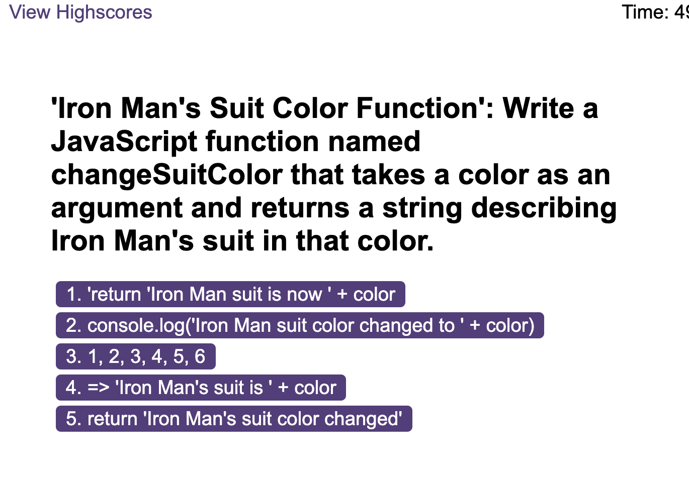
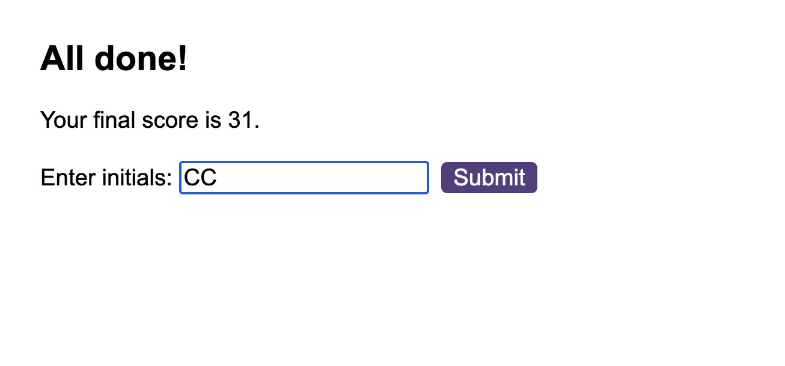
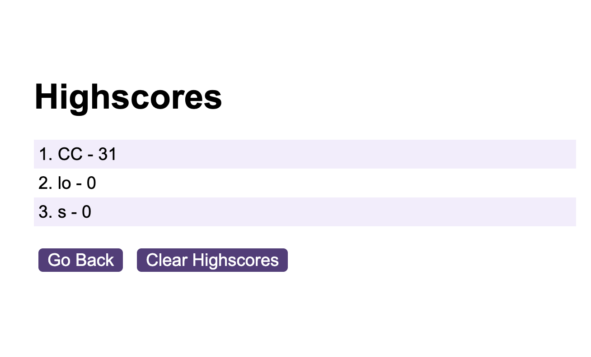

# code-quiz

## About this project

This project is to create a browser-based timed coding quiz with multiple-choice questions, using dynamic HTML, CSS, and JavaScript for a responsive interface, applying skills you've learned in this module.

### User Story

AS A coding boot camp student.
I WANT to take a timed quiz on JavaScript fundamentals that stores high scores.
SO THAT I can gauge my progress compared to my peers.

### Built With

- ![HTML]
- ![CSS]
- ![JAVASCRIPT]

### Acceptance Criteria

Create a code quiz that contains the following requirements:

- A start button that when clicked a timer starts and the first question appears.
  - Questions contain buttons for each answer.
  - When answer is clicked, the next question appears
  - If the answer clicked was incorrect then subtract time from the clock
- The quiz should end when all questions are answered or the timer reaches 0.
  - When the game ends, it should display their score and give the user the ability to save their initials and their score

## Roadmap

They will be added as the pesudocode is made

- [x] Click the button and start the timer
  - [x] Display first question
  - [x] When the answer is clicked, show the next question
  - [x] If the answer is incorrect, subtract 5s from the timer
- [x] When the timer reaches 0, or all the quiz is answered, the quiz should be ended
  - [x] display their score of the remaining timer, let user input their initials to save their score
- [x] User can see the history of highest score list in highscores page
  - [x] Display The list of score in the order of highest
  - [x] User can delete the score history by clicking clear score button
  - [] Refactor variable names and comments
  - [] Deploy the application

These roadmap result will look like thepicture below

The following mock-up animation demonstrates the application functionality:

## Important note

add what techniques are used here

### Preview

#### This is the Github page

[code-quiz](https://sebecjeanluc.github.io/code-quiz/)

### Credits

This is a practice for the bootcamp. The starter file is protected by the bootcamp.

### Third-party service

N/A

### License

Distributed under the MIT License. See `LICENSE.txt` for more information.

## Contact

Tak Kawamura - [@\_takuyakawamura](https://twitter.com/_takuyakawamura) - tkawamura11@gmail.com

<!-- MARKDOWN LINKS & IMAGES -->
<!-- https://www.markdownguide.org/basic-syntax/#reference-style-links -->

[HTML]: https://img.shields.io/badge/HTML-orange
[CSS]: https://img.shields.io/badge/CSS-blue
[JAVASCRIPT]: https://img.shields.io/badge/Javascript-yellow
